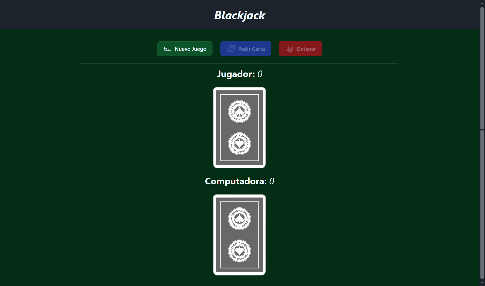
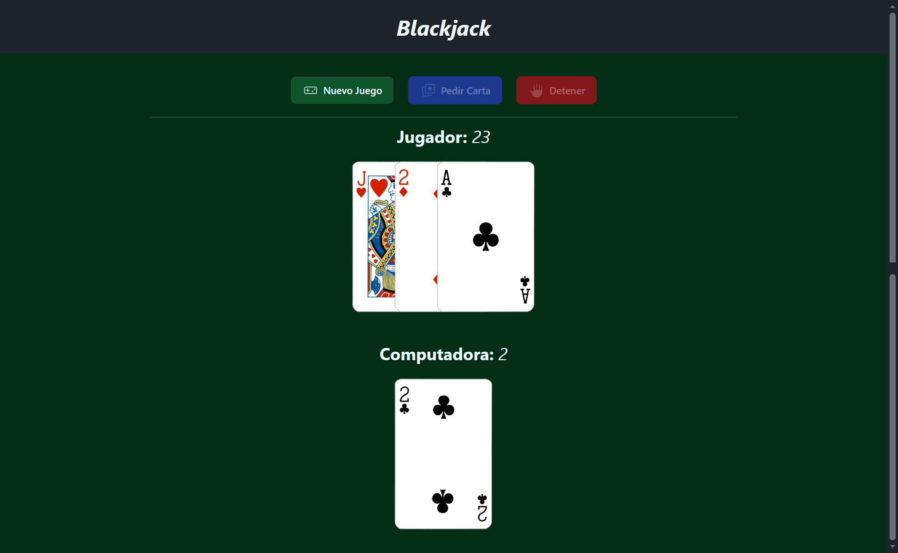
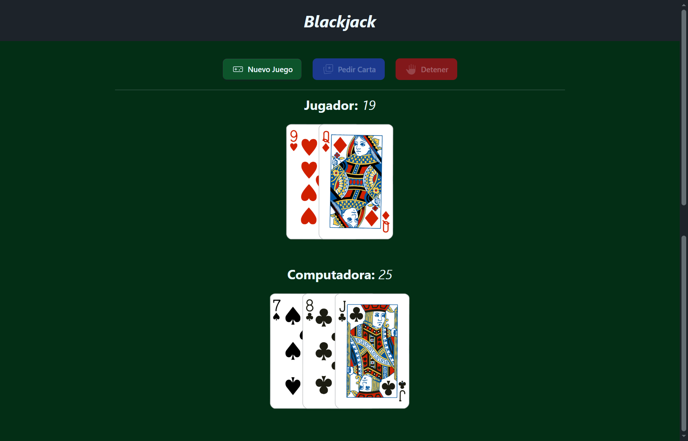

# Blackjack

<p align="center">
  &nbsp;
  
</p>

**Blackjack** también llamado veintiuno, es un juego de cartas, propio de los casinos con una o más barajas inglesas de 52 cartas sin los comodines, que consiste en sumar un valor lo más próximo a 21 pero sin pasarse. Hecho con **Angular** y para los estilos **Tailwind CSS** y **daisyUI**.

## Run Locally

Clone the project

```bash
  git clone https://github.com/miguel-camara/blackjack-angular.git
```

Go to the project directory

```bash
  cd blackjack-angular
```

Install dependencies

```bash
  npm install
```

Start the server

```bash
  npm run start
```

## Demo

[Demo](https://blackjack-miguel.netlify.app/)

## Screenshots







## Features

- **Juego de Blackjack:** Es la recreación del juego que consiste en sacar cartas de forma aleatoria, las cuales van sumando un valor y el objetivo es acercarse al 21 pero sin excederse.
- **Nuevas Juego:** Se crea la baraja de forma aleatoria para poder iniciar el juego.
- **Pedir Carta:** Obtienes una carta de la baraja creada de forma aleatoria cada carta va sumando un valor a la puntuación del jugador. Las cartas del 2-10 tienen su respectivo valor. La J|Q|K = 10, A = 11.
- **Detener:** Mínimo se tiene que tener una carta para poder detener el juego y que inicie el turno de la computadora.
- **Ganador:** El ganador se determina por quien se acerca más al 21, si el jugador excede el 21 la computadora gana y viceversa.

## Tech Stack

**Frontend:** Angular, Tailwind CSS y daisyUI
