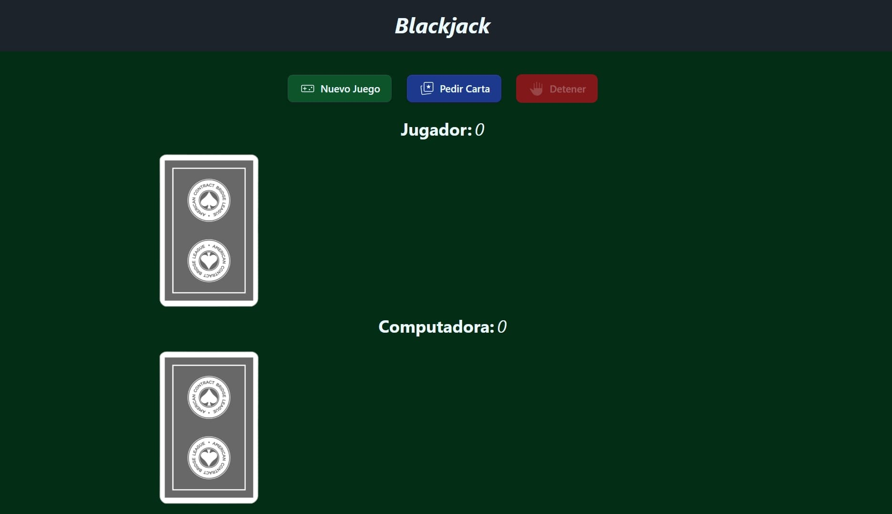
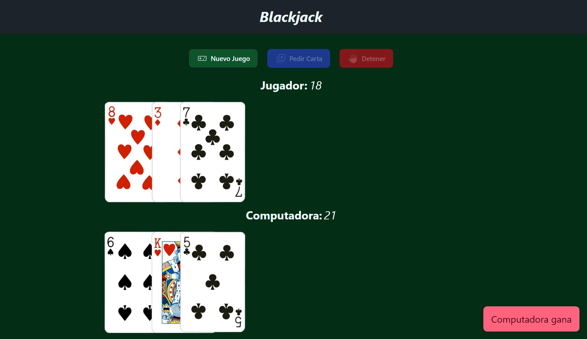

# Blackjack

This project was generated using [Angular CLI](https://github.com/angular/angular-cli) version 21.2.6.

## Development server

To start a local development server, run:

```bash
npm run start
```

Once the server is running, open your browser and navigate to `http://localhost:4200/`. The application will automatically reload whenever you modify any of the source files.

## Building

To build the project run:

```bash
ng build
```

This will compile your project and store the build artifacts in the `dist/` directory. By default, the production build optimizes your application for performance and speed.

## Screenshots



#


